# 概要
GitHubにsshキーを設定してpushするまでの作業メモ。

# 作業メモ
## ssh key作成
```ssh-keygen -t ed25519```

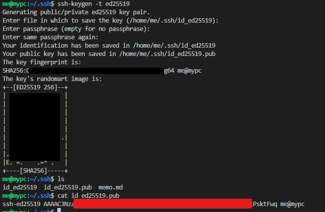

## git hubへの登録
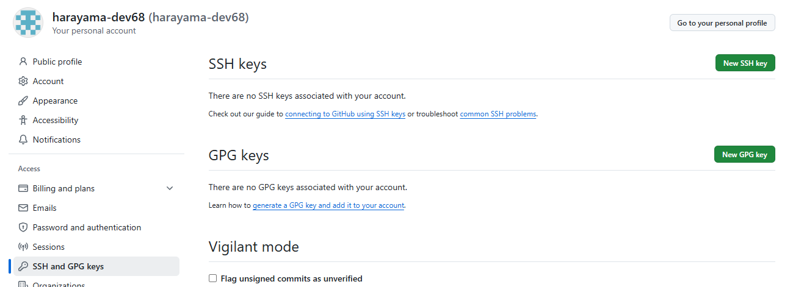
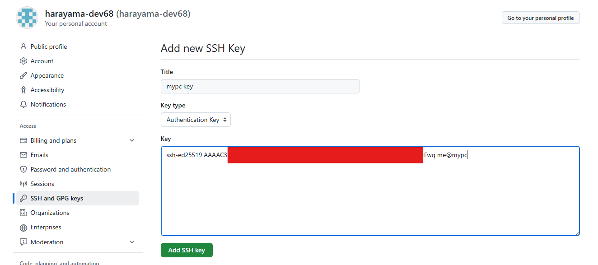

## ssh config設定
code ~/.ssh/config
```
Host github.com
    HostName github.com
    IdentityFile ~/.ssh/id_ed25519.pub
```

### 接続エラー（公開鍵のアクセス権過剰）
オーナー以外にも見える状態は怒られる。
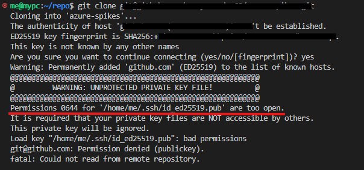  
[SSH接続時のパーミッションエラー解消方法について](https://qiita.com/mittsukan/items/fa85db0ca125b8ed9ebe)  
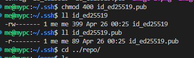  

### 接続エラー（ssh configにユーザ設定がなかったから？）
結論から言うと関係なかった。
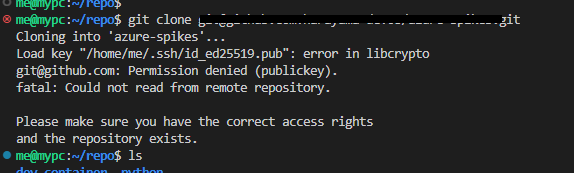
https://zenn.dev/nikaera/articles/ssh-config-github
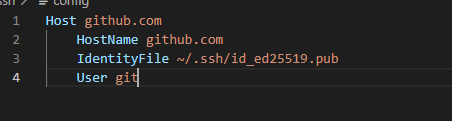

### 接続エラー解決（ssh config公開鍵を指定していたら）
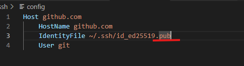
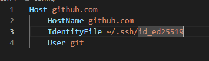
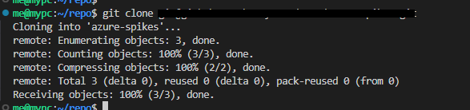

### git設定
host/devcontainerで設定を共有しやすいようにlocalに設定。
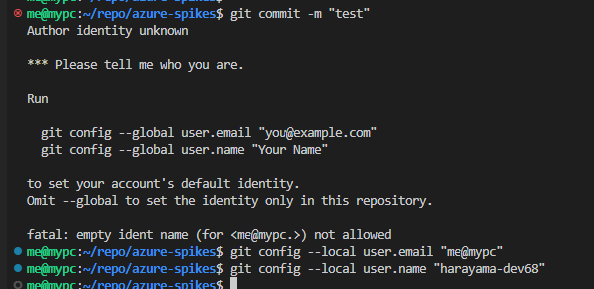

## push成功
上記設定でGitHubにpush成功した。
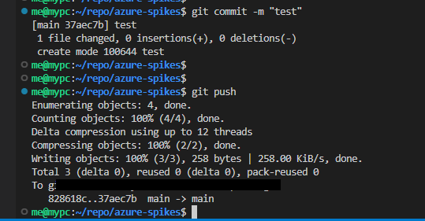


