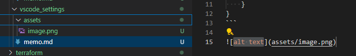

# 概要
VSCodeの設定備忘録

# 作業メモ
## コピー先のディレクトリ指定
参考：https://code.visualstudio.com/updates/v1_79#_markdowncopyfilesdestination

スクリーンショット（Win + Shift + s）をペースト時、自動的にassetsフォルダがコピーされる。  
asssetsフォルダがない場合は作成される。
```
{
    "markdown.copyFiles.destination": {
        "*": "./assets/${fileName}"
    }
}
```

  
