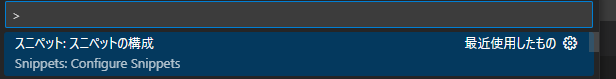
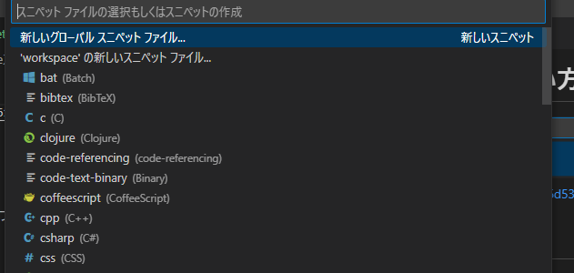

# vscodeスニペット使い方
参考：https://qiita.com/12345/items/97ba616d530b4f692c97

## スニペット作成



# markdonw
Markdownのスニペット入力が有効かできなかったのでここに記載。

## 折り畳み

```
<details><summary>すごく長い文章とかプログラムとか</summary>

```python
print('Hello world!')
```　
</details>

```

<details><summary>すごく長い文章とかプログラムとか</summary>

```python
print('Hello world!')
```

