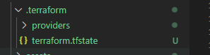
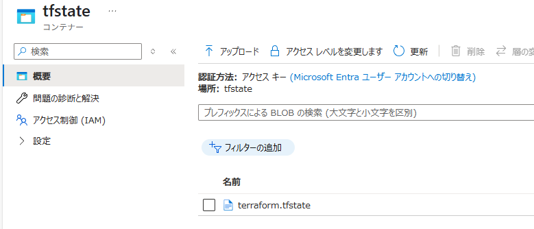
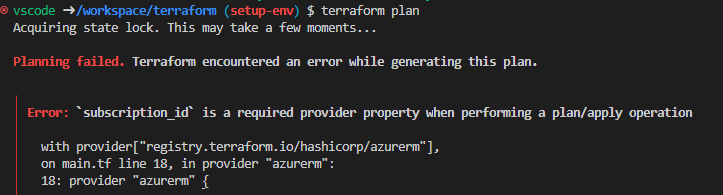
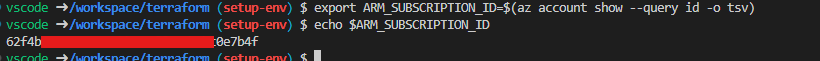
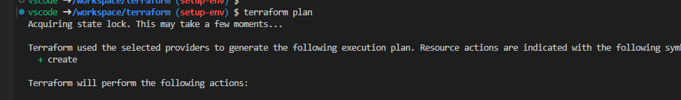
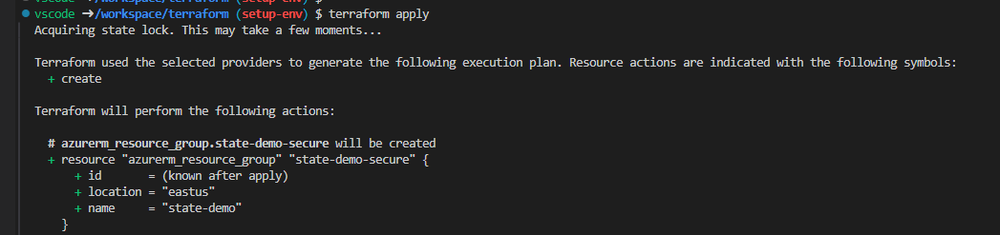
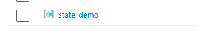

# 概要
terraform環境構築作業のメモ

# 作業メモ
1. tfstateファイル置き場作成  

   ```bash
   location=japaneast
   resource_group_name=rg-sp-common
   az group create --location ${location} --name ${resource_group_name}
   az storage account create -n stspcommon -g ${resource_group_name} -l ${location} --sku Standard_LRS
   az storage container create --name tfstate --account-name stspcommon

   # 自分のSubscrioptionとEntra IDを取得
   user_id=$(az ad signed-in-user show --query id -o tsv)
   subscription_id=$(az account show --query id -o tsv)

   # ストレージアカウントへの「データ共同作成者」ロールを付与
   az role assignment create \
      --assignee ${user_id} \
      --role "Storage Blob Data Contributor" \
      --scope "/subscriptions/${subscription_id}/resourceGroups/${resource_group_name}/providers/Microsoft.Storage/storageAccounts/stspcommon"
   ```

1. テスト用tfファイル作成  
   <details><summary>テスト用tfファイル内容</summary>

   ```
   terraform {
        required_providers {
            azurerm = {
                source  = "hashicorp/azurerm"
                version = "~>4.27.0"
            }
        }
        backend "azurerm" {
                resource_group_name  = "rg-sp-common"
                storage_account_name = "stspcommon"
                container_name       = "tfstate"
                key                  = "terraform.tfstate"
                use_azuread_auth     = true
        }
   }

   provider "azurerm" {
       features {}
   }

   resource "azurerm_resource_group" "state-demo-secure" {
        name     = "state-demo"
        location = "eastus"
   }
   ```

   </details>  


1. ```terrarom init```実行  
   実行後、ローカルとblobにtfstateファイルが置かれた。
   
   


1. ```terrarom plan```実行  
   * ```terrarom plan```実行時に```subscription_id```がないと怒られた。
       

   * 対処として、```ARM_SUBSCRIPTION_ID```を設定。  
     ```export ARM_SUBSCRIPTION_ID=$(az account show --query id -o tsv)```  
       
     参考：https://registry.terraform.io/providers/hashicorp/azurerm/latest/docs#argument-reference  
   * planコマンドが通ることを確認した。  
       

1. ```terrarom apply```実行  
   applyコマンドが通り、リソースが期待通り作成されることを確認した。
     
   
